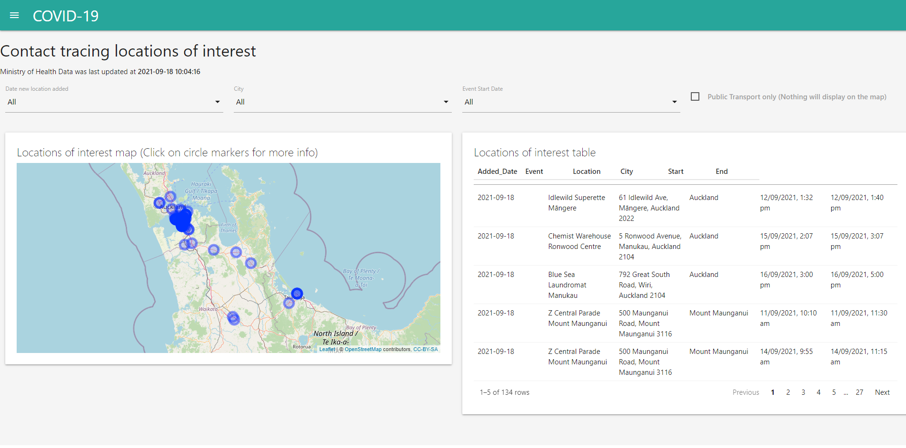

# COVID-19: Contact tracing locations of interest

This shiny application helps the users to visualise the map and table of locations of interest for people who may be contacts of COVID-19 cases in the community. This shiny application is currently live and can be found in <https://kcha193.shinyapps.io/covid_locations/>. The screenshot of the shiny app is shown below.

This application provides users to filter down the selection for

+ the date new locations were added,
+ the city of location (although it is mostly Auckland), and
+ the starting dates of the relevant times of these locations.

to narrow down the amount the information provided.

Please refer to the official [Ministry of Health website's locations of interest](https://www.health.govt.nz/our-work/diseases-and-conditions/covid-19-novel-coronavirus/covid-19-health-advice-public/contact-tracing-covid-19/covid-19-contact-tracing-locations-interest) for the most up to date list of locations.
